<div align="center">


<br/>


<br/>

<p align="center">
  <a href="mailto:mouadatlas5@gmail.com">
    
  </a>
  <a href="https://linkedin.com/in/mouad-souhal">
    
  </a>
  <a href="https://github.com/MouadShl">
    
  </a>
  <a href="https://www.kaggle.com/souhalmouad">
    
  </a>
</p>


</div>

---

## 🧭 Who I Am

```python
class MouadSouhal:

    name            = "Mouad Souhal"
    role            = "Data Science Engineer"
    location        = "Rabat, Morocco 🇲🇦"
    education       = "Data Science Engineering Sup MTI Rabat (2026)"
    current_status  = "Open to full-time CDI opportunities"

    experience = (
            "Completed a Data Science & NLP engineering internship "
            "at Ziwig Morocco"
    )

    identity        = [
        "Data Scientist",
        "Machine Learning Engineer",
        "Data Analyst",
        "AI Builder"
    ]

    interests       = [
        "Data Science",
        "Machine Learning",
        "Deep Learning",
        "AI",
        "Natural Language Processing",
        "Data Engineering",
        "Business Intelligence",
        "NLP",
        "MLOps",
        "Data Analytics"
    ]


    open_to         = [
        "Data Scientist roles",
        "ML/AI Engineer roles",
        "Data Analyst roles",
        "Research and innovation projects",
        "Technical collaborations"
    ]

    mindset         = "Data is everywhere. Intelligence is built deliberately."
```

<div align="center">

### I am not just learning tools.
### I am learning how to think with data, build with AI, and communicate results clearly.

</div>

---

## 🎯 Professional Direction

<table>
  <tr>
    <td width="33%" align="center">
      <h3>📊 Data Analytics</h3>
      <p>Cleaning data, extracting insights, building dashboards, and translating numbers into decisions that drive real business value.</p>
    </td>
    <td width="33%" align="center">
      <h3>🤖 Machine Learning</h3>
      <p>Designing and evaluating predictive models, optimizing performance, and building reliable data-driven workflows end to end.</p>
    </td>
    <td width="33%" align="center">
      <h3>🧠 AI Applications</h3>
      <p>Leveraging NLP, computer vision, and intelligent systems to build tools that solve concrete, real-world problems.</p>
    </td>
  </tr>
</table>

<div align="center">

Open to all data roles - **Data Scientist** - **Data Analyst** - **ML Engineer** - **AI Engineer** - **MLOps**

</div>

---

## 🧰 Tech Stack

<div align="center">

### Languages & Data


<br/><br/>


---

### AI, Machine Learning & NLP


<br/><br/>


---

### Data Engineering & Infrastructure


<br/><br/>


<br/><br/> 


---

### Business Intelligence


</div>

---

## 🚀 Featured Projects

<div align="center">

### 🇲🇦 Credit Card Default Risk Prediction - Moroccan Banking Portfolio

<a href="https://github.com/MouadShl/credit-risk-morocco">
  
</a>
<a href="https://credit-risk-morocco-lb5g69tibchzjlhx3qppqv.streamlit.app">
  
</a>

> End-to-end ML pipeline - 30,000 customers - 7 models compared - XGBoost tuned - SHAP explainability - Streamlit dashboard deployed in production


<br/><br/>

### 🔬 Data Intelligence Pipeline - Ziwig Morocco (PFE)

<a href="https://github.com/MouadShl/Ziwig-internship">
  
</a>

> Full NLP pipeline on 301,707 patient messages - CamemBERT + RoBERTa sentiment analysis - BERTopic topic modeling - SQL Server Data Warehouse - 2 Power BI dashboards delivered to client


</div>

---

## 🧠 How I Think

<table>
  <tr>
    <td width="50%">
      <h3>🔍 Analytical</h3>
      <p>I break problems down systematically - questioning assumptions, decomposing complexity, and isolating the real signal behind the noise. Every dataset tells a story. My job is to find it.</p>
    </td>
    <td width="50%">
      <h3>⚙️ Practical</h3>
      <p>I build things that can actually be used, tested, explained, and improved - not just theoretically elegant inside a notebook. Usability and reliability matter as much as accuracy.</p>
    </td>
  </tr>
  <tr>
    <td width="50%">
      <h3>🧬 Curious</h3>
      <p>Deeply interested in NLP, model behavior, robustness, and how intelligent systems genuinely support human decisions at scale. I read, explore, and experiment continuously.</p>
    </td>
    <td width="50%">
      <h3>📈 Growth-Oriented</h3>
      <p>Every project is a chance to improve - technically, in communication, in documentation quality, and in execution. I do not just deliver work. I elevate it.</p>
    </td>
  </tr>
</table>

---

## 🚀 Current Focus

```yaml
currently:
  - Actively applying for Data Scientist roles at Moroccan banks
  - Polishing production-ready ML portfolio projects
  - Deepening SHAP-based model explainability practices
  - Refining end-to-end MLOps and deployment workflows

open_to:
  - Data Scientist roles
  - ML Engineer positions
  - Data Analyst opportunities
  - Data Engineering roles
  - Research and technical collaborations
```

---

## 📊 GitHub Activity

<div align="center">




<br/><br/>


</div>

---

## 🤝 Let's Connect

<div align="center">

I am open to full-time CDI opportunities, technical collaborations, and meaningful Data and AI projects.

<br/>

<a href="mailto:mouadatlas5@gmail.com">
  
</a>
<a href="https://linkedin.com/in/mouad-souhal">
  
</a>
<a href="https://github.com/MouadShl">
  
</a>
<a href="https://www.kaggle.com/souhalmouad">
  
</a>

<br/><br/>

### "Turning data into decisions, and decisions into impact."

<br/>


</div>
